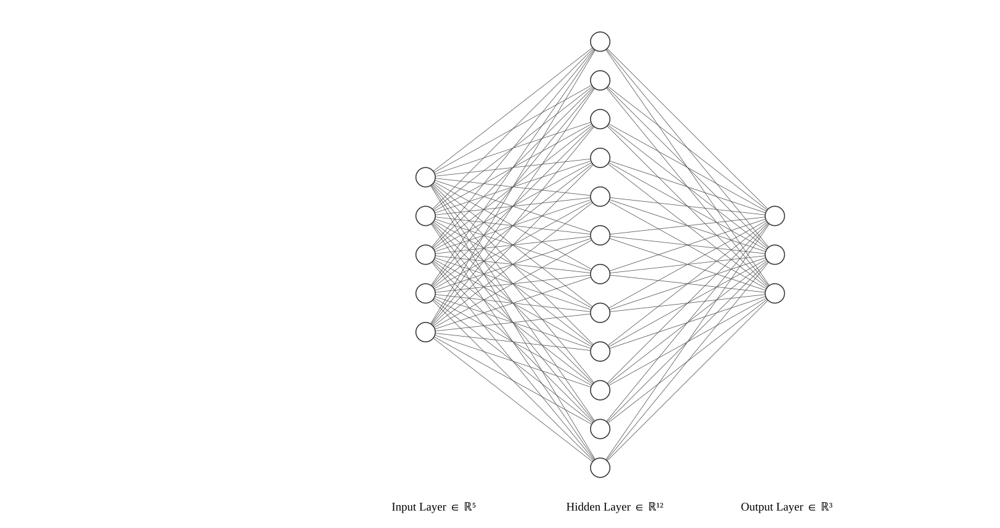

# L16a: Feedforward Neural Networks (FNNs)
In this lecture, we introduce feedforward neural networks (FNNs), artificial neural network architectures where connections between layers do not form cycles. 

> __Learning Objectives:__
> 
> By the end of this lecture, you will be able to:
>
> * __FNN Architecture__: Define feedforward neural networks as layered structures where information flows from input nodes through hidden layers to output nodes without cycles. Understand that each node applies a linear transformation followed by a non-linear activation function.
> * __FNN as Function Composition__: Describe how an FNN computes a mapping from inputs to outputs as a series of function compositions, where each layer transforms the output of the previous layer.
> * __FNN Training__: Explain how FNNs are trained using backpropagation, which computes gradients of a loss function with respect to network parameters using the chain rule, enabling gradient descent optimization.
>
> __Sources for this lecture:__
> * [John Hertz, Anders Krogh, and Richard G. Palmer. 1991. Introduction to the theory of neural computation. Addison-Wesley Longman Publishing Co., Inc., USA.](https://dl.acm.org/doi/10.5555/104000)
> * [Mehlig, B. (2021). [Machine Learning with Neural Networks. Chapter 5: Perceptrons and Chapter 6: Stochastic Gradient Descent](https://arxiv.org/abs/1901.05639v4)

Let's get started!
___

## Examples
Today, we will use the following example to illustrate key concepts:

> [▶ Build a multi-class image classifier using an FNN](CHEME-5800-L16a-Example-FNN-ImageClassification-Fall-2025.ipynb). In this example, we build a _deep_ feedforward neural network to classify handwritten digits. We use [the MNIST handwritten image dataset](https://en.wikipedia.org/wiki/MNIST_database), which contains 60,000 images of handwritten digits (0-9). The goal is to train the model to recognize these digits based on pixel values.

___

## Origin Story: McCulloch-Pitts Neurons
In [their paper, McCulloch and Pitts (1943)](https://link.springer.com/article/10.1007/BF02478259) explored how the brain could produce complex patterns by using many [interconnected _basic cells (neurons)_](https://en.wikipedia.org/wiki/Biological_neuron_model). McCulloch and Pitts proposed a _simplified model_ of a neuron that made a foundational contribution to the development of artificial neural networks.

Suppose we have a neuron that takes an input vector $\mathbf{n}(t) = (n^{(t)}_1, n^{(t)}_2, \ldots, n^{(t)}_{m})$, where each component $n_j\in\mathbf{n}$ is a binary value (`0` or `1`) representing the state of predecessor neurons $n_1,n_2,\ldots,n_m$ at time $t$. The state of neuron $k$ at time $t+1$ is given by:
$$
\begin{equation*}
n_{k}(t+1) = \sigma\left(\sum_{j=1}^{m} w_{kj} n_j(t) - \theta_k\right)
\end{equation*}
$$
where $\sigma:\mathbb{R}\rightarrow\{0,1\}$ is an _activation function_ that maps the weighted sum of inputs to a binary output. In the original paper, $n_k(t+1)\in\{0,1\}$, $w_{kj}$ is the weight of the connection from predecessor neuron $j$ to neuron $k$, and $\theta_k$ is the threshold for neuron $k$. 
* __Activation function__: In the original McCulloch-Pitts model, the activation function $\sigma$ is a step function: the output is `1` if the weighted sum of inputs exceeds the threshold $\theta_k$, and `0` otherwise. The neuron "fires" (produces output `1`) if the total input is greater than or equal to $\theta_k$.
* __Parameters__: The weights $w_{kj}\in\mathbb{R}$ and threshold $\theta_k\in\mathbb{R}$ determine neuron behavior. Weights can be positive or negative, representing the strength and direction of influence from input neurons. The threshold determines how much input is needed for the neuron to fire.

While this model simplifies real biological neurons, it laid the groundwork for more complex artificial neural networks. The key idea: by combining many simple neurons in a network, we can create complex functions and approximate any continuous function. This idea is at the heart of modern deep learning.

__Hmmmm__. These ideas _really_ seem familiar. Have we seen this before? Yes! the McCulloch-Pitts Neuron underpins [The Perceptron (Rosenblatt, 1957)](https://en.wikipedia.org/wiki/Perceptron), [Hopfield networks](https://en.wikipedia.org/wiki/Hopfield_network) and [Boltzmann machines](https://en.wikipedia.org/wiki/Boltzmann_machine). Wow!!

___

## Activation Functions
The activation function $\sigma:\mathbb{R}\rightarrow\mathbb{R}$ determines the output of a neuron based on its input. It takes the weighted sum of inputs and applies a (typically non-linear) transformation to produce the output. The choice of activation function affects the learning process and network performance. Common activation functions include:

> __Sigmoid function__: A smooth S-shaped curve that maps inputs to the range $(0, 1)$:
>$$\sigma(x) = \frac{1}{1 + e^{-x}}$$
> The sigmoid function is often used in output layers for binary classification, as the output can be interpreted as a probability. 

> __Hyperbolic tangent (tanh)__: Similar to sigmoid but maps inputs to the range $(-1, 1)$:
>$$\tanh(x) = \frac{e^x - e^{-x}}{e^x + e^{-x}}$$
> The tanh function is often used in hidden layers because its outputs are centered around zero.

> __Rectified Linear Unit (ReLU)__: A piecewise linear function that outputs the input if positive and zero otherwise:
>$$\text{ReLU}(x) = \max(0, x)$$
> ReLU helps mitigate the vanishing gradient problem, making it a popular choice for hidden layers in deep networks. However, it can suffer from [the dying ReLU problem](https://arxiv.org/abs/1903.06733), where neurons become inactive and stop learning.

> __Softmax function__: Converts a vector of raw scores (logits) into a probability distribution over $K$ classes:
>$$\text{softmax}(z_i) = \frac{e^{z_i}}{\sum_{j=1}^{K} e^{z_j}}$$
> where $z_i$ is the raw score for class $i$. The softmax function ensures output probabilities sum to 1, making it suitable for multi-class classification.

We use the [activation functions exported by the `NNlib.jl` package](https://fluxml.ai/NNlib.jl/dev/).

___

## Feedforward Neural Networks
Consider the network shown above. The network has three layers: an input layer (five nodes), a hidden layer (twelve nodes), and an output layer (three nodes). 

* __Input layer__: The input layer receives raw data, with each node representing one feature of the input vector. It does not perform computation—its role is to pass input values to the next layer.
*  __Hidden layer__: The hidden layer performs computations on the input data. Each node takes the input vector $\mathbf{x}$ and applies a linear transformation followed by a non-linear activation function. The output of each node passes to the next layer. The number of nodes and layers can vary depending on the task complexity. Networks with multiple hidden layers are called _deep neural networks_.
* __Output layer__: The output layer produces the network output $\mathbf{y} = (y_{1},y_{2},\dots,y_{k})$ where $\mathbf{y}\in\mathbb{R}^{k}$. Each node takes output from the hidden layer and applies a linear transformation followed by an activation function. For multi-class classification, the output can be interpreted as probabilities for each class using softmax.

### Function Composition
Suppose we have a feedforward neural network with $L$ layers. The network has $d_{in}$ input nodes (layer 0), $i=1,2,\dots, L-1$ hidden layers where hidden layer $i$ has $m_{i}$ nodes, and the output layer $L$ has $d_{out}$ nodes. Each hidden layer is fully connected to the previous and subsequent layers (no connections within a layer and no self-connections). Information flows from input to output, forming a feedforward structure.

#### Inputs, Outputs, and Parameters
* __Inputs and outputs__: Let $\mathbf{x} = (x_{1},x_{2},\dots,x_{d_{in}},1)^{\top}$ be the _augmented_ input vector, where the extra `1` allows the bias term to be included in the weight vector. Let $\mathbf{z}^{(i)} = (z^{(i)}_{1},z^{(i)}_{2},\dots,z^{(i)}_{m_{i}})^{\top}$ be the output vector of layer $i$. Finally, let $\hat{\mathbf{y}}= (y_{1},y_{2},\dots,y_{d_{out}})^{\top}$ be the predicted output vector.

* __Parameters__: Each node $j=1,2,\dots,m_{i}$ in layer $i\geq{1}$ has a parameter vector $\mathbf{w}^{(i)}_{j} = (w^{(i)}_{j,1},w^{(i)}_{j,2},\dots,w^{(i)}_{j,m_{i-1}}, b^{(i)}_{j})^{\top}$, where $w^{(i)}_{j,k}\in\mathbb{R}$ is the weight connecting node $k$ in layer $i-1$ to node $j$ in layer $i$, and $b^{(i)}_{j}\in\mathbb{R}$ is the bias term for node $j$ in layer $i$.

#### Layer Computations
A feedforward neural network computes a series of function compositions. For layer $1$ with $m_{1}$ nodes, the output given input $\mathbf{z}^{(0)} = \mathbf{x}$ is:
$$
\begin{equation*}
\mathbf{z}^{(1)} = \begin{pmatrix}
\sigma_{1}\left((\mathbf{z}^{(0)})^{\top}\mathbf{w}^{(1)}_{1}\right) \\
\sigma_{1}\left((\mathbf{z}^{(0)})^{\top}\mathbf{w}^{(1)}_{2}\right) \\
\vdots \\
\sigma_{1}\left((\mathbf{z}^{(0)})^{\top}\mathbf{w}^{(1)}_{m_{1}}\right)
\end{pmatrix}
\end{equation*}
$$
where $\mathbf{w}^{(1)}_{j}$ is the parameter vector for node $j$ in layer $1$, and $\sigma_{1}$ is the activation function for layer $1$. The output $\mathbf{z}^{(1)}\in\mathbb{R}^{m_{1}}$ passes to layer $2$, which has $m_{2}$ nodes:
$$
\begin{equation*}
\mathbf{z}^{(2)} = \begin{pmatrix}
\sigma_{2}\left((\mathbf{z}^{(1)})^{\top}\mathbf{w}^{(2)}_{1}\right) \\
\sigma_{2}\left((\mathbf{z}^{(1)})^{\top}\mathbf{w}^{(2)}_{2}\right) \\
\vdots \\
\sigma_{2}\left((\mathbf{z}^{(1)})^{\top}\mathbf{w}^{(2)}_{m_{2}}\right)
\end{pmatrix}
\end{equation*}
$$

We can write the output of layer $2$ as: $\mathbf{z}^{(2)} = \sigma_{2}\circ\sigma_{1}(\mathbf{z}^{(0)})$, where $\sigma_{2}\circ\sigma_{1}$ is the composition of the two layer functions. Generalizing, a feedforward neural network computes:
$$
\begin{equation*}
\hat{\mathbf{y}} = f_{\theta}(\mathbf{x}) = \sigma_{L}\circ\sigma_{L-1}\circ\dots\circ\sigma_{1}(\mathbf{x})
\end{equation*}
$$
where $\sigma_{L}$ is the activation function for the output layer, $\mathbf{x}$ is the augmented input vector, $\hat{\mathbf{y}}\in\mathbb{R}^{d_{out}}$ is the network output, and $\theta$ represents all network parameters (weights and biases).

> __Key Insight__: A feedforward neural network $f_{\theta}:\mathbb{R}^{d_{in}}\rightarrow\mathbb{R}^{d_{out}}$ is a function that maps input $\mathbf{x}$ to output $\hat{\mathbf{y}}$. We can apply all the tools of calculus and linear algebra to analyze and optimize neural networks: compose them, differentiate them, and optimize their parameters.

### Parameterization
The parameters of layer $i$ can be represented as the matrix $\mathbf{W}_{i}\in\mathbb{R}^{m_{i}\times(m_{i-1}+1)}$, where each row contains the weights and bias for one node. All parameters $(\mathbf{W}_{1},\mathbf{W}_{2},\dots,\mathbf{W}_{L})$ can be packed into a single vector $\theta$:
$$
\begin{equation*}
\theta \equiv  (w^{(1)}_{1,1},\dots,w^{(1)}_{1,m_{0}}, b^{(1)}_{1}, w^{(1)}_{2,1},\dots, b^{(1)}_{2}, \ldots, w^{(L)}_{d_{out},m_{L-1}}, b^{(L)}_{d_{out}})
\end{equation*}
$$

#### How Many Parameters?
The number of parameters in a feedforward neural network depends on the number of layers and nodes per layer. For a network with $L$ layers where layer $i$ has $m_{i}$ nodes:
$$
\begin{align*}
\text{Number of parameters} &= \sum_{i=1}^{L} m_{i}(m_{i-1}+1) \\
&= \underbrace{\sum_{i=1}^{L} m_{i} m_{i-1}}_{\text{weights}} + \underbrace{\sum_{i=1}^{L} m_{i}}_{\text{biases}} 
\end{align*}
$$
where $m_{0} = d_{in}$ is the number of input features.

__Where do these parameters come from?__ The parameters are learned through a gradient descent algorithm called __backpropagation__ by minimizing a loss function appropriate for the task (e.g., regression or classification).
___

## Training
Suppose we have a training dataset $\mathcal{D} = \{(\mathbf{x}_{1},\mathbf{y}_{1}),\dotsc,(\mathbf{x}_{n},\mathbf{y}_{n})\}$ with $n$ examples, where 
$\mathbf{x}_{i}\in\mathbb{R}^{d_{in}}$ is the $i$-th feature vector and $\mathbf{y}_{i}$ is the corresponding output. The output can be a discrete label for classification tasks (e.g., $y_{i}\in\{0,1,\dots,K-1\}$ for $K$ classes) or a continuous value for regression tasks (e.g., $y_{i}\in\mathbb{R}$).

Feedforward neural networks are trained using [the _backpropagation_ algorithm](https://en.wikipedia.org/wiki/Backpropagation), a _supervised learning_ method based on gradient descent. Backpropagation computes the gradient of a loss function with respect to network weights and biases using the chain rule.

> __Alternative Optimization Methods__: Other optimization algorithms such as genetic algorithms, particle swarm optimization, and simulated annealing can theoretically be used. However, gradient descent and its variants remain the most common due to computational efficiency and well-understood convergence properties.

The algorithm involves two steps:   
1. **Forward Pass**: Compute the network output for an input by passing it through each layer and applying activation functions, yielding a predicted output $\hat{\mathbf{y}}$.  
2. **Backward Pass**: Compute the gradient of the loss function with respect to each parameter by propagating the error backward through the network using the chain rule.

### Forward Pass
__Initialize__: Set the weights and biases of the network randomly or using an initialization heuristic. Let $\mathbf{z}^{(0)} = (x_{1},x_{2},\dots,x_{d_{in}}, 1)^{\top}$ be the augmented input vector.

For each layer $i=1,2,\dots,L$ __do__:
1. For each node $j=1,2,\dots,m_{i}$ in layer $i$ __do__:
      1. Compute the pre-activation: $a^{(i)}_{j} = (\mathbf{z}^{(i-1)})^{\top}\mathbf{w}^{(i)}_{j}$
      2. Compute the activation: $z^{(i)}_{j} = \sigma_{i}(a^{(i)}_{j})$
2. Store the layer output: $\mathbf{z}^{(i)} = (z^{(i)}_{1}, z^{(i)}_{2},\dots,z^{(i)}_{m_{i}})^{\top}$
3. The output of the final layer is the predicted output: $\hat{\mathbf{y}} = \mathbf{z}^{(L)}$

### Backward Pass (Gradient Descent)
The backward pass computes the gradient of the loss function with respect to each parameter by propagating the error backward through the network using the chain rule.

__Loss Function__: The loss function $\mathcal{L}(\mathbf{y},\hat{\mathbf{y}})$ measures the difference between the actual output $\mathbf{y}$ and predicted output $\hat{\mathbf{y}} = f_{\theta}(\mathbf{x})$. The loss is large when the prediction is far from the actual value and small when close. For regression tasks, the mean squared error (MSE) loss $\mathcal{L} = \frac{1}{n}\sum_{i=1}^{n}\|\mathbf{y}_i - \hat{\mathbf{y}}_i\|_{2}^{2}$ is commonly used, while [cross-entropy loss](https://en.wikipedia.org/wiki/Cross-entropy) is typical for classification.

We assume $\mathcal{L}$ is differentiable with respect to the parameters, allowing us to compute the gradient $\nabla_{\theta}{\mathcal{L}}$. The gradient points in the direction of steepest increase. We iteratively update parameters to minimize the loss:
$$
\begin{equation*}
\theta_{k+1} = \theta_{k} - \alpha\cdot\nabla_{\theta}\mathcal{L}(\theta_{k})\quad\text{where }k = 0,1,2,\dots
\end{equation*}
$$
where $k$ is the iteration index, $\nabla_{\theta}\mathcal{L}$ is the gradient of the loss with respect to $\theta$, and $\alpha > 0$ is the _learning rate_.

__Stopping Criteria__: Gradient descent continues until a stopping criterion is met, such as parameter convergence $\|\theta_{k+1} - \theta_{k}\|_{2} \leq \epsilon$, small gradient magnitude $\|\nabla_{\theta}\mathcal{L}(\theta_{k})\|_{2} \leq \epsilon$, or reaching maximum iterations.

### Stochastic Gradient Descent
Computing the full gradient over all training examples can be expensive. Stochastic Gradient Descent (SGD) is a less expensive approximation. Let $\mathcal{L}(\theta)$ denote the average loss over all $n$ training examples:
$$
\begin{equation*}
\mathcal{L}(\theta) = \frac{1}{n}\sum_{i=1}^{n}\mathcal{L}_{i}(\theta)
\end{equation*}
$$
where $\mathcal{L}_{i}(\theta)$ is the loss on example $i$. The full gradient descent update is:
$$
\begin{equation*}
\theta_{k+1} = \theta_{k} - \frac{\alpha}{n}\sum_{i=1}^{n}\nabla_{\theta}\mathcal{L}_{i}(\theta_{k})
\end{equation*}
$$

In _stochastic gradient descent_, we approximate the full gradient using a single randomly sampled training example:
$$
\begin{equation*}
\theta \gets \theta - \alpha\cdot\nabla_{\theta}\mathcal{L}_{i}(\theta)
\end{equation*}
$$
where $i$ is randomly selected from $\mathcal{D}$.

__Initialize__: Choose initial parameters $\theta$ and learning rate $\alpha$.

While not converged __do__:
1. Store current parameters: $\theta_{\text{old}} \gets \theta$
2. Randomly shuffle the training data
3. For $i = 1,2,\dots,n$ __do__:
    1. Compute the update: $\theta \gets \theta - \alpha\cdot\nabla_{\theta}\mathcal{L}_{i}(\theta)$
4. Check convergence: if $\|\theta - \theta_{\text{old}}\|_{2} \leq \epsilon$, then converged
5. Optionally update learning rate $\alpha$

### Mini-Batch Gradient Descent
Mini-batch gradient descent randomly samples a batch of $b$ training examples at each iteration:
$$
\begin{equation*}
\theta \gets \theta - \frac{\alpha}{b}\sum_{i=1}^{b}\nabla_{\theta}\mathcal{L}_{i}(\theta)
\end{equation*}
$$
where $b$ is the mini-batch size.

> __Mini-Batch Size__: The mini-batch size is a hyperparameter. Small mini-batches can lead to faster convergence but with more noise. Larger mini-batches provide more stable convergence but may be slower per epoch. The choice depends on the problem and available computational resources.

The computation of $\nabla_{\theta}\mathcal{L}_{i}(\theta)$ is simplified using [automatic differentiation](https://arxiv.org/abs/1502.05767), which efficiently computes derivatives of compositions of elementary functions.

## Strengths and Weaknesses of FNNs

### Strengths
* __Universal Approximation__: [FNNs are universal approximators](https://en.wikipedia.org/wiki/Universal_approximation_theorem), meaning they can approximate any continuous function to arbitrary precision given sufficient hidden units and training data.
* __Flexibility__: FNNs can be applied to classification, regression, and generative modeling tasks. They can work with different data types including images, text, and time series. 
* __Non-linearity__: Non-linear activation functions enable FNNs to learn complex non-linear relationships that linear models cannot capture. They can classify non-linearly separable datasets.

### Weaknesses
* __Overfitting__: FNNs can overfit training data, especially when the model is complex or training data is limited. Regularization techniques (dropout, L1/L2 regularization, early stopping) can mitigate this issue.
* __Computational Cost__: Training FNNs can be computationally expensive for large datasets or deep networks. Modern hardware and software frameworks help, but efficient implementation requires expertise.
* __Interpretability__: FNNs are often considered __black box__ models, making it difficult to interpret predictions. This is a disadvantage in applications where interpretability is required (e.g., healthcare, finance). Techniques such as [LIME](https://arxiv.org/abs/1602.04938) and [SHAP](https://arxiv.org/abs/1705.07874) can help improve interpretability.

___

## Summary
Feedforward neural networks are layered architectures where information flows from input to output without cycles, with each node computing a linear transformation followed by a non-linear activation function.

> __Key Takeaways__:
>
> * __FNN Architecture__: Feedforward neural networks consist of input, hidden, and output layers connected in a directed acyclic structure. Each node applies a weighted sum followed by a non-linear activation function. The network computes a series of function compositions, where each layer transforms the output of the previous layer.
> * __Training via Backpropagation__: FNNs are trained using backpropagation, which computes gradients of a loss function with respect to network parameters using the chain rule. Stochastic gradient descent and mini-batch variants provide computationally efficient approaches to parameter optimization.
> * __Universal Approximation with Trade-offs__: FNNs can approximate any continuous function given sufficient capacity, making them applicable to classification, regression, and other tasks. However, they are prone to overfitting, computationally expensive to train, and often lack interpretability.

The concepts introduced here, layered architectures, activation functions, and gradient-based training, form the foundation for more advanced neural network architectures that we will explore next semester.
___
